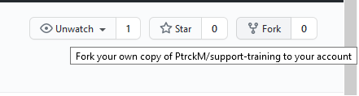

# support-training
Onboarding New Support Role - Learning Basic Git

General workflow
1. fork the repo  
    
2. create new branch (see: branch naming guidelines)
3. After done with your fix, guides or updates.
4. save your changes, stage and commit. (see: commit naming guidelines)
5. rebase upstream changes into your branch
6. push your commits
7. Submit Pull Request (see: PR naming guidelines)
8. Include a description of your changes
 
Add that repo as an upstream remote:
`git remote add upstream https://github.com/PtrckM/support-training`

### Branch naming guidelines:
Your branch should follow this naming convention: 

    feat/...
    bug/...
    refactor/...
    test/...
    doc/...

- editing hummingbot-docs and miner-docs use `doc/` for example `doc/branch_name`

### Commit naming guidelines
Make commits to your feature branch

    (feat) Add a new feature
    (fix) Fix inconsistent tests [Fixes #0]
    (refactor) ...
    (cleanup) ...
    (test) ...
    (doc) ...

- editing hummingbot-docs and miner-docs use `(doc)` for example `(doc) update broken links and typo`

### Pull Request Guidelines
Make a pull request

Make a clear pull request from your fork and branch to the upstream branch, detailing exactly what changes you made and what feature this should add. The clearer your pull request is the faster you can get your changes incorporated into this repo.

If the team requests changes, you should make more commits to your branch to address these, then follow this process again from rebasing onwards.

Once you get back here, make a comment requesting further review and someone will look at your code again. If it addresses the requests, it will get merged, else, just repeat again.

- You are using approved title ("feat/", "fix/", "docs/", "refactor/", etc)
- include a brieft description of your PR
- include a screenshot of your changes.
- check the `Allow edits and access to secrets by maintainers`